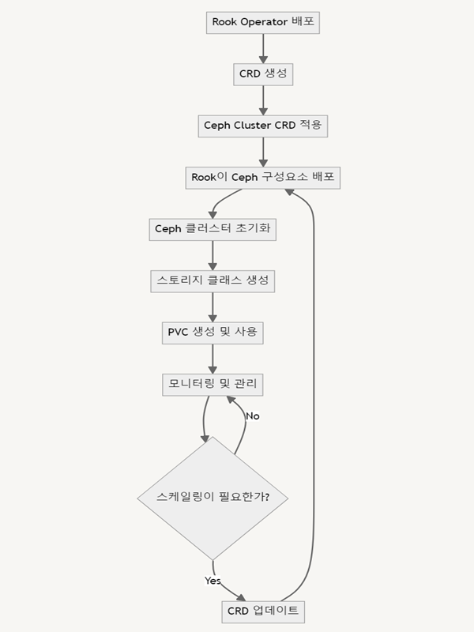

이번 글에서는 쿠버네티스의 저장소 배포를 위해 필요한 'Rook-Ceph' 채택에 관해 이야기해보려 합니다.

원래는 현재 학과 서버에 구현된 쿠버네티스의 내용에 대해 먼저 게재한 뒤, 온프레미스에서의 분산 스토리지 구현을 설명드리려고 했어요.

그런데, 제가 직접 서버를 만들다보니, 자체적인 스토리지 시스템을 조성해야 하는 상황에 부딪혔는데, 이 과정이 그리 쉽지 않았습니다. 그 이유 중 가장 큰 비중을 차지하는 문제는 바로 '정보 부족' 이었습니다.

아무래도 요즘엔 클라우드 환경의 활용이 우선시 되는 추세이다 보니, 대부분의 글들이 클라우드 환경에서 제공해주는 스토리지 서비스를 활용한 내용에 대해서만 설명되어 있었습니다. 따라서 스토리지 구현에 꽤 많은 시간이 투자됐는데, 저와 같은 처지에 계신 입문자 분들이 너무 많은 시간을 소모하시지 않기를 바라는 마음에 이 글을 먼저 올리게 되었습니다.

서론이 다소 길어졌는데요, 바로 Rook-Ceph 채택 사유에 대해 말씀 드리겠습니다!

학과에서 실습 환경 제공 필요 사유 중 가장 큰 비중을 차지하는 것은 크게 두 가지 입니다.

첫 번째로는 **'부정행위 방지'**입니다. 학과 내에선 특정 교과목의 실습을 위한 Jupyter Lab 환경이 제공되는 보드를 사용하고 있는데요, 비싼 기자재이다 보니 개수가 적어 학과의 모든 학생들에게 교과 목적으로 제공해줄 수 없습니다. 따라서 3 ~ 4명 정도 그룹을 형성하여 하나의 머신에서 과제를 공동으로 진행하는데, 이때 전 학기 수강생이 남긴 파일을 가지고 실습을 제출하면 부정행위로 간주됩니다. 따라서 전 사용자가 필수적으로 수행한 과제를 이용 종료 시점에 삭제해야 하며, 이후에 사용하는 새로운 사용자 또한 해당 내용을 인지하고, 잔여 파일이 있다면, 파일 삭제 등의 별도 조치를 취해야 한다는 번거로움이 있습니다.

두 번째로는 앞서 말씀 드린 바인 **'실습 설비 또는 환경 조성을 위한 비용 발생'**입니다. 학과 입장에선 실습 설비 구매를 위한 비용이 과도하게 발생하는 문제, 학부생 입장에선 프로젝트 진행 시 사용되는 클라우드 서비스 이용 등에 발생하는 비용 문제가 발생합니다. 이는 타 회사의 제품을 사용하기 때문에 생기는 문제인데요, 실제로 마빈 보드, 교육용 라즈베리파이 키트 같은 경우 1ea당 100 ~ 300 만원, Colab Pro의 경우 월 $4.99, Colab Pro+의 경우 월 $49.99 등 정말 큰 비용이 요구됩니다.

이 두 문제를 해결하기 위해선, 학생 개개인의 독립된 실습 환경이 보장되어야 하고, 또한 학생이 참여하고 있는 프로젝트의 규모에 따라 각기 다른 리소스 양을 적절히 할당해주어야 합니다. 이때 필수적인 리소스 중 하나가 바로 영구 저장소(Persistent Volume, 이하 PV)입니다.

기존에는 PV를 파드에 할당 시키기 위해 해당 파드가 존재하는 노드의 디렉토리를 직접 설정했는데, 이 디렉토리 경로를 yaml 상에선 'hostPath'로 명세합니다. 호스트 PC에 실재하는 디렉토리 경로를 사용하기 때문에, 초기 구현이 쉽다는 장점이 있습니다. 그러나 이러한 방식은 두 가지 문제점이 있습니다.

첫 번째는 **'보안'**입니다. 호스트 PC의 루트 디렉토리 예하의 디렉토리 및 파일들에 접근하는 방식이기 때문에, 직접적으로 접근한다는 점에 있어 보안상의 문제가 우려됩니다.

두 번째는 **'작동 오류 시 특정 파드로의 올바른 PV 연결 불가'**입니다. 만약 어떠한 문제가 발생하여 파드 혹은 노드에 작동 오류 발생 시, 파드의 desired value 유지를 위해 쿠버네티스가 해당 파드를 재가동합니다. 이때, 만약 다중 클러스터 환경에서 이러한 문제가 발생 했다면, 문제가 발생했던 파드에 해당 파드가 똑같이 재생성 될 것이라는 보장이 없습니다. 물론, yaml내 설정을 통해 특정 노드에 고정적으로 파드가 생성되도록 할 수도 있지만, 만약 특정 노드가 재기 불가능한 문제가 발생한다면, 해당 노드가 복구될 때 까지 해당 파드는 사용할 수 없을 수 있다는 단점이 있어 실시간으로 desired value를 유지하려는 저희의 지향하는 바와는 다소 거리가 먼 방법입니다. 이때 만약 원래 사용되던 파드가 다른 노드에 배치될 경우, 해당 파드는 기존 노드의 hostPath와 연결되도록 설정되어 있기에, 정상 작동되지 않습니다.

이 뿐만 아니라 서버 관리자라면 '비효율적인 저장소 할당 방법'이라는 점도 있습니다. PV를 파드가 사용하기 위해선 반드시 이를 요청하기 위한 영구 저장소 요청(Persistent Volume Claim, 이하 PVC)가 적용되어야 합니다. 이때 하나의 PVC엔 단 하나의 PV만 연결되기 때문에 만약 수십 명의 학부생들에게 독자적인 공간을 제공해주려면 그 많은 파드, PV, PVC를 직접 하나하나 할당시켜주어야 합니다. 이는 최초 환경 조성, 향후 서버 관리 측면에도 상당히 불편하며, 비효율적입니다.

요약하자면, 원활한 저장소 환경 관리를 위해 필요한 일들은 다음과 같습니다.

1. **호스트 PC의 디렉토리에 직접적인 접근이 없는 저장소 할당**
2. **관리자의 원시적인 PV 할당 지양**
3. **파드 혹은 노드의 비정상적인 종료 이후에도 올바른 PV 할당**

1, 3번 문제를 해결하기 위해선 클러스터 전범위로 적용되는 파일 시스템이 필요합니다. 또한 각 PV에 대한 상태를 모니터링 하며, 리소스의 작동 오류에도 올바른 저장소에 연결해주는 시스템도 구축되어야 합니다.

2번 문제를 해결하기 위해선 저장소가 동적으로 할당되는, 즉 동적 프로비저닝(Dynamic Proviosioning)이 필요합니다. 관리자가 새로운 파드 생성, 혹은 기존 파드 삭젫 인해 생기는 PV 관리 문제를 직접 해결하지 않고 오직 PVC의 유무 만으로 PV 생성 여부가 결정되는 시스템이 필요합니다.

앞서 언급된 문제들을 해결할 수 있는 방법이 바로 Rook과 Ceph을 활용하는 것입니다.

Rook은 오픈소스 클라우드 네이티브 스토리지 오케스트레이션 도구입니다. 이와 더불어 사용되는 Ceph은 오픈소스 분산 스토리지 시스템으로, Rook을 통해 Ceph을 통해 생성된 저장소 객체를 관리합니다.

Rook-Ceph의 Management Flow는 하단의 이미지와 같습니다.

## Rook-Ceph Management Flow

위의 과정을 통해 Rook이 Ceph에서 정의된 가상의 리소스들을 관리하여 관리자가 요구한 상태(Desired State)를 유지하도록 도와줍니다.

다음 글은 Rook-Ceph의 구성요소에 대해 설명드리겠습니다. 읽어주셔서 감사합니다!!!
